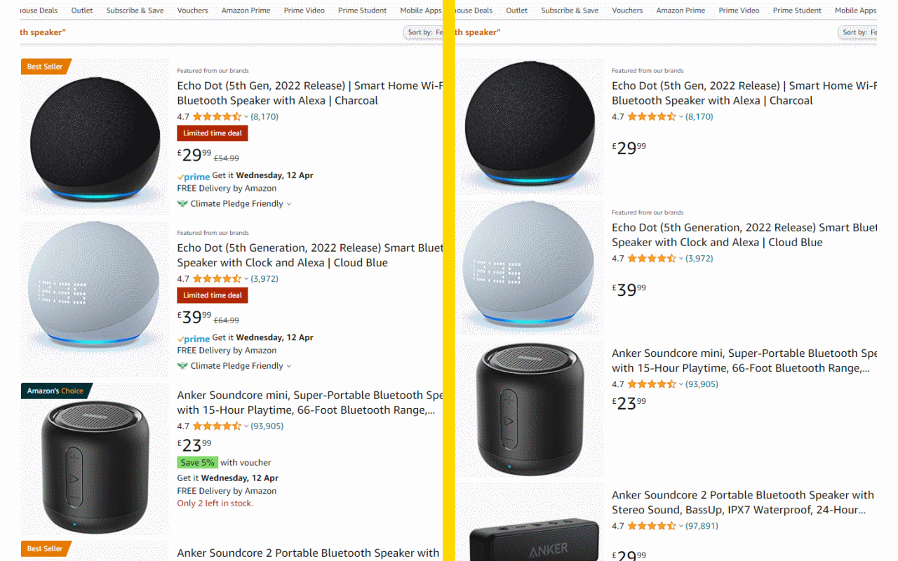

# Wiki - Product Navigator Chrome Extension

*The repository for the **Product Naviator** Chrome Extension. The extension removes digital nudges from search pages on Amazon UK.*

# Testing :microscope:

To locally test the current version of the Product Navigator extension in your Chrome Browser:

1. Install the latest version of **Product Navigator BETA** in your Google Chrome Browser
2. Visit https://amazon.co.uk
3. Test extension

> The **BETA** version of the extension is only viewable in Chrome Store by invited testers. This version contains latest changes.

# Concept

## User Identification

tbd

## Group Assignment (control / treatment)

tbd

## Displaying Badges

> **Definition**   A **badge** is a visual element attached to a single product presentation on an online platform to generate more user attention for this specific product.

The rules and behavior how badges are displayed are explained in this section.

The default styling for a user that has the extension installed is a "blank" styling, i.e. all platform specific badges are set to `display: none` and are therefore not displayed. This is needed since otherwise, flickering would happen and users could see the inital platform's styling (for a few miliseconds). The default styling is set in the `manifest.json` .

The personalization steps can always be narrowed down to the following cases/decision. Given an item from a platform:

1. There is a platform badge attached to the item
   1. **Blank Style.** Hide the platform badge. This is the default behavior of the CE (see note above)
   2. **Platform Style.** Show (unhide) the platform badge. 
   3. **Custom Style.** Replace the plaform badge with a custom ECM badge. This means 
      1. Modify the platform badge (e.g. add classes, create styling, insert custom text/HTML tags etc. to existing HTML badge element) and show (unhide) the modified platform badge OR 
      2. Keep the platform badge hidden and create & insert a new HTML component for the ECM badge (would make case 2.2 easier, i.e. "reusability")
2. There is no platform badge attached to the item
   1. **Blank/Platform Style.** Do nothing. Neither a platform nor a custom badge will be shown.
   2. **Custom Style.** Show a custom badge. Depending on the platform the respective HTML element might be missing at this point and needs to be inserted (what is not the case in 1.3.1 since there is already a hidden platform badge)
