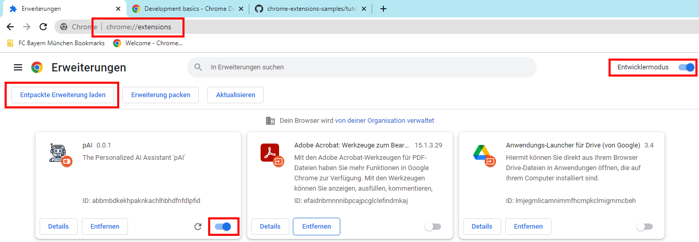

# Wiki - pAI Chrome Extension :space_invader:

"Personalized AI" (PAI) repository for Google Chrome extension.

# Local Testing :microscope:

To test the current version of the Google Chrome Extension **pAI**

* Download this repository
* Type `chrome://extensions/` in your Chrome Browser
* Enable developer mode (top right corner)
* Select "Entpackte Erweiterung laden" (top left corner)
* Choose the currently downloaded repository
* Enable the pAI extension

